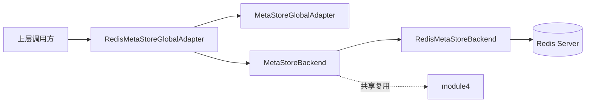
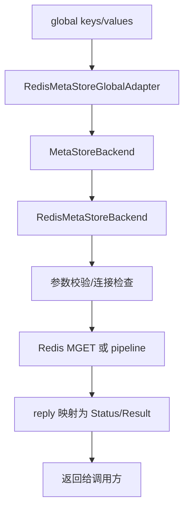
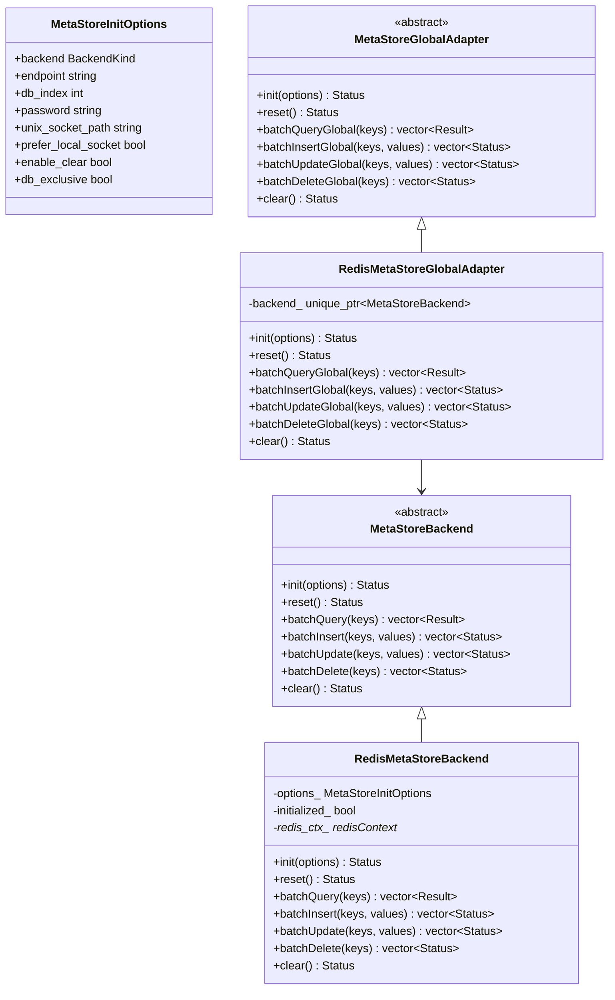
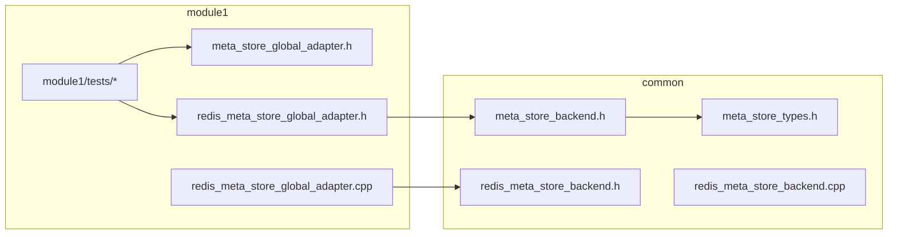
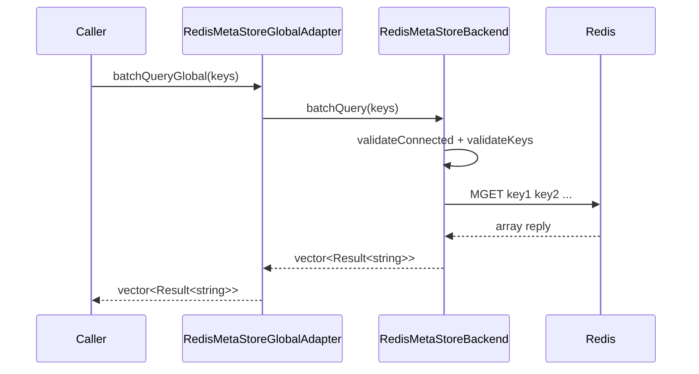
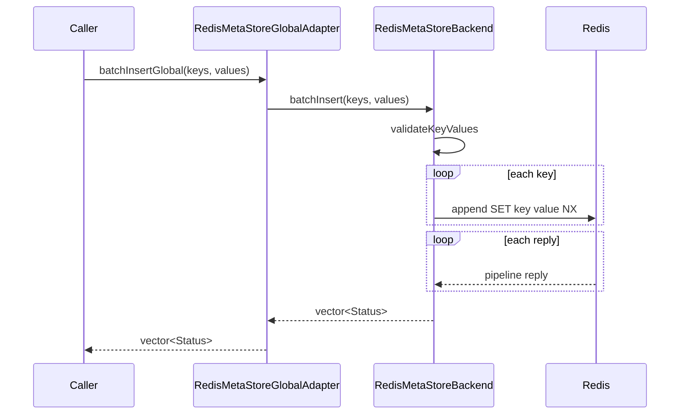
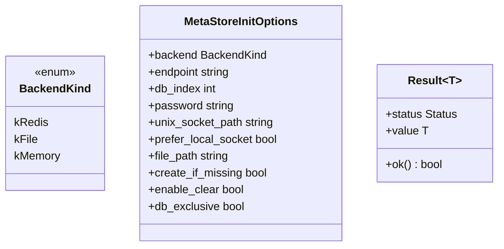
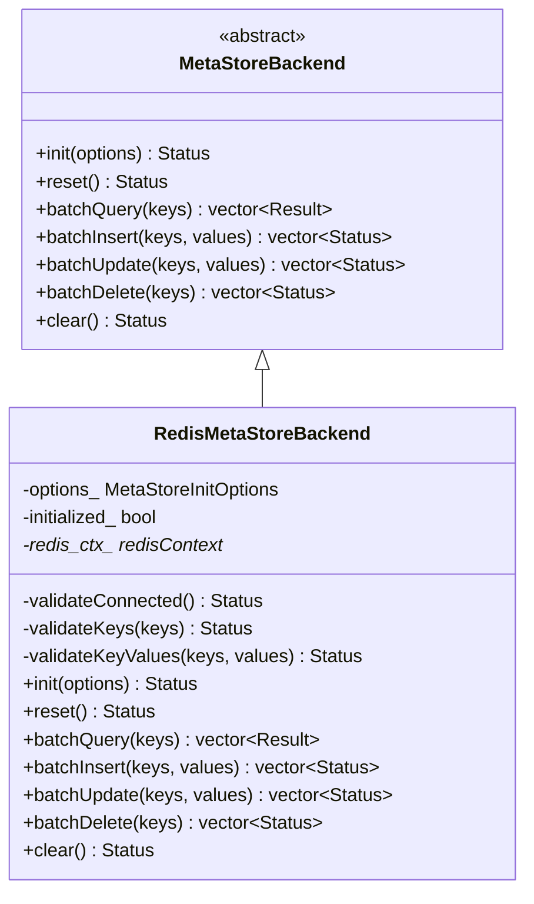
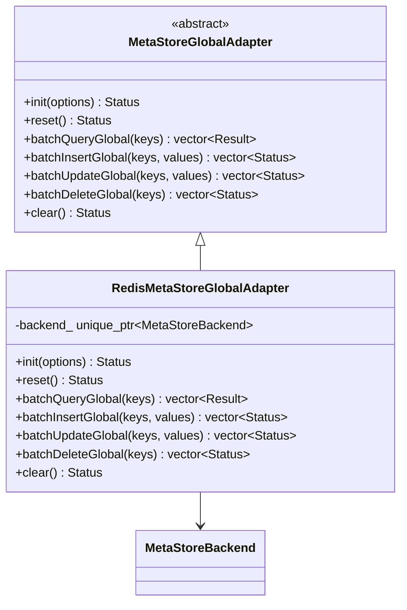

# Module1 MetaStoreGlobalAdapter 详细设计说明书

## 1. 文档元信息

### 1.1 封面信息

| 项目 | 内容 |
|------|------|
| **产品/项目名称** | codeRe-1 / Module1 MetaStore |
| **文档类型** | 详细设计说明书 (LDD) |
| **文档版本** | V1.0 |
| **密级** | 内部公开 |

### 1.2 修订记录

| 版本 | 日期 | 修订章节 | 修订内容 | 修订人 | 审核人 |
|------|------|----------|----------|--------|--------|
| V1.0 | 2026-04-15 | 初版 | 按 LDD 模板整理 module1 当前实现 | Codex | - |

### 1.3 摘要

`module1` 对外暴露 global key 语义的批量元数据访问接口。当前实现把 Redis 连接、pipeline、reply 映射、clear 保护逻辑下沉到共享的 `MetaStoreBackend` / `RedisMetaStoreBackend`，而 `RedisMetaStoreGlobalAdapter` 只负责维持 global API 与上层兼容。该设计既保证了 `module1` 对外接口稳定，也为 `module4` 和未来其他 metastore 模块复用底层能力提供了统一支点。

## 2. 引言

### 2.1 编写目的

本文档描述 `module1` 当前代码的详细设计，重点说明 public API、共享 backend 分层方式以及关键批量流程。

### 2.2 适用范围

适用范围：

- `module1/include/metastore/*.h`
- `module1/src/redis_meta_store_global_adapter.cpp`
- `common/metastore/*.h`
- `common/metastore/redis_meta_store_backend.cpp`

不适用范围：

- RPC server 侧实现
- `module4` 的结构化 value 与锁语义
- 非 Redis backend 的具体实现

### 2.3 术语定义

| 术语 | 定义 |
|------|------|
| Global Key | `module1` 对外公开的 key 语义 |
| Backend | 底层 key/value 存储实现 |
| Batch Query | 按输入顺序返回 `Result<std::string>` 的查询接口 |
| Batch Write | 批量插入、更新、删除接口，返回逐条 `Status` |

### 2.4 设计原则

| 原则 | 说明 |
|------|------|
| 接口稳定优先 | 保持 `MetaStoreGlobalAdapter` 对上层稳定 |
| 复用优先 | Redis 细节沉淀到共享 backend |
| 语义分层 | Global 语义层与字符串 KV 存储层解耦 |
| 批量优先 | 所有对外操作保持批量接口 |

### 2.5 参考资料

| 类型 | 路径 |
|------|------|
| 接口 | [module1/include/metastore/meta_store_global_adapter.h](/home/a/Desktop/codeRe-1/module1/include/metastore/meta_store_global_adapter.h) |
| 接口 | [module1/include/metastore/redis_meta_store_global_adapter.h](/home/a/Desktop/codeRe-1/module1/include/metastore/redis_meta_store_global_adapter.h) |
| 实现 | [module1/src/redis_meta_store_global_adapter.cpp](/home/a/Desktop/codeRe-1/module1/src/redis_meta_store_global_adapter.cpp) |
| 共享层 | [common/metastore/meta_store_backend.h](/home/a/Desktop/codeRe-1/common/metastore/meta_store_backend.h) |
| 共享层 | [common/metastore/redis_meta_store_backend.h](/home/a/Desktop/codeRe-1/common/metastore/redis_meta_store_backend.h) |

## 3. 系统概述

### 3.1 系统目标

| 目标 | 描述 |
|------|------|
| 功能目标 | 提供 global key 的批量查询、插入、更新、删除、初始化、重置和 clear |
| 架构目标 | 将 Redis 细节收敛到共享 backend |
| 工程目标 | 为 `module4` 和未来模块复用底层 KV 能力 |
| 质量目标 | 保持顺序稳定、删除幂等、错误显式返回 |

### 3.2 与现有系统的关系

### 3.3 模块清单

| 模块名 | 文件路径 | 职责 | 依赖 |
|------|------|------|------|
| `MetaStoreGlobalAdapter` | `module1/include/metastore/meta_store_global_adapter.h` | 定义 global 语义抽象接口 | `Status`、`Result<T>` |
| `RedisMetaStoreGlobalAdapter` | `module1/include/metastore/redis_meta_store_global_adapter.h` / `.cpp` | 对外提供 Redis 版 global adapter | `MetaStoreBackend` |
| `MetaStoreBackend` | `common/metastore/meta_store_backend.h` | 定义共享 backend 抽象 | `MetaStoreInitOptions` |
| `RedisMetaStoreBackend` | `common/metastore/redis_meta_store_backend.*` | 管理 Redis 连接和批量命令 | hiredis |
| `MetaStoreTypes` | `common/metastore/meta_store_types.h` | 定义配置和通用结果类型 | `Status` |

### 3.4 核心数据流

## 4. 架构设计

### 4.1 逻辑视图

### 4.2 开发视图

### 4.3 时序图

#### 4.3.1 批量查询流程

#### 4.3.2 批量写入流程

## 5. 模块详细设计

### 5.1 `MetaStoreTypes` 设计

#### 5.1.1 模块职责

- 定义 `BackendKind`
- 定义 `MetaStoreInitOptions`
- 定义 `Result<T>`

#### 5.1.2 类图设计

#### 5.1.3 接口定义

| 方法/API | 说明 | 性能约束 |
|----------|------|----------|
| `MetaStoreInitOptions` | 统一后端初始化配置 | 配置对象，无热点要求 |
| `Result<T>::ok()` | 判断成功状态 | O(1) |

### 5.2 `MetaStoreBackend` / `RedisMetaStoreBackend` 设计

#### 5.2.1 模块职责

- `MetaStoreBackend` 定义底层共享 KV 抽象
- `RedisMetaStoreBackend` 封装 Redis 连接、AUTH/SELECT、pipeline、reply 映射、clear

#### 5.2.2 类图设计

#### 5.2.3 接口定义

| 方法/API | 说明 | 性能约束 |
|----------|------|----------|
| `batchQuery` | 使用 `MGET` 批量查询 | 单批一次往返 |
| `batchInsert` | 使用 `SET NX` pipeline | 单批一次发送 |
| `batchUpdate` | 使用 `SET XX` pipeline | 单批一次发送 |
| `batchDelete` | 使用 `DEL` pipeline | 单批一次发送 |
| `clear` | 执行受保护 `FLUSHDB` | 非热点路径 |

#### 5.2.4 错误处理

| 错误码 | 说明 | 处理方式 |
|--------|------|----------|
| `InvalidArgument` | key 为空、size mismatch、endpoint 非法 | 直接返回 |
| `MetadataError` | 连接错误、AUTH/SELECT/pipeline 错误 | 返回批次错误 |
| `AlreadyExists` | `SET NX` 冲突 | 按条目返回 |
| `NotFound` | `SET XX` 未命中或查询 miss | 按条目返回 |
| `NotSupported` | clear 未启用 | 拒绝执行 |

### 5.3 `MetaStoreGlobalAdapter` / `RedisMetaStoreGlobalAdapter` 设计

#### 5.3.1 模块职责

- 固定 `module1` 的 global 语义接口
- 将实现细节委托给共享 backend

#### 5.3.2 类图设计

#### 5.3.3 接口定义

| 方法/API | 说明 | 性能约束 |
|----------|------|----------|
| `batchQueryGlobal` | global 语义批量查询 | 仅委托开销 |
| `batchInsertGlobal` | global 语义批量插入 | 仅委托开销 |
| `batchUpdateGlobal` | global 语义批量更新 | 仅委托开销 |
| `batchDeleteGlobal` | global 语义批量删除 | 仅委托开销 |

## 6. 可靠性设计

| 故障类型 | 检测机制 | 处置方案 |
|------|------|------|
| Redis 连接失败 | `redis_ctx_ == nullptr` 或 `ctx->err != 0` | 返回 `MetadataError` |
| 参数非法 | 输入校验 | 返回 `InvalidArgument` |
| clear 误用 | `enable_clear/db_exclusive` 校验 | 返回 `NotSupported` |

## 7. 性能设计

| 子项 | 设计 |
|------|------|
| 批量查询 | `MGET` |
| 批量写入 | hiredis pipeline |
| 本机优化 | Unix socket 优先，本机失败后回退 TCP |

## 8. 安全性设计

| 子项 | 设计 |
|------|------|
| 认证 | 使用 Redis AUTH |
| 数据保护 | 不负责 value 加密，由上层处理 |
| 危险操作保护 | clear 受配置保护 |

## 9. 测试要点

| 文件 | 覆盖重点 |
|------|------|
| `module1/tests/init_reset_test.cpp` | 生命周期 |
| `module1/tests/batch_operations_test.cpp` | 批量接口语义 |
| `module1/tests/unix_socket_test.cpp` | Unix socket 优先逻辑 |
| `module1/tests/build_surface_test.cpp` | 共享头文件可见性 |

## 10. 实现优先级

### Phase 1: 核心功能

| 任务 | 描述 | 工作量 |
|------|------|--------|
| 保持 global API | 对上层稳定输出 | 已完成 |
| 引入共享 backend | 复用 Redis 访问能力 | 已完成 |

### Phase 2: 后续扩展

| 任务 | 描述 | 工作量 |
|------|------|--------|
| 新增 file/memory backend | 拓展 backend 类型 | 后续 |
| 增强 metrics/logging | 提升可观测性 | 后续 |

## 11. 附录

| 文件路径 | 说明 |
|------|------|
| `module1/include/metastore/meta_store_global_adapter.h` | Global 抽象接口 |
| `module1/include/metastore/redis_meta_store_global_adapter.h` | Redis 版 global adapter |
| `common/metastore/redis_meta_store_backend.cpp` | Redis backend 核心逻辑 |
