# Mooncake 数据搬移路径梳理

这份文档把仓库里和“数据到底怎么搬”直接相关的路径串起来，重点回答下面几个问题：

- 数据真正是从哪里搬到哪里
- `master`、`metadata service`、`Transfer Engine`、`Client/store server` 分别负责什么
- `Put / Get / SSD offload / SSD 回读 / replica copy&move` 这些路径有什么区别

本文基于当前仓库里的实现和文档整理，重点参考：

- `docs/source/design/mooncake-store.md`
- `docs/source/design/ssd-offload.md`
- `mooncake-store/src/client_service.cpp`
- `mooncake-store/src/transfer_task.cpp`
- `mooncake-store/src/file_storage.cpp`
- `mooncake-store/src/master_service.cpp`
- `mooncake-transfer-engine/src/transfer_engine.cpp`

## 1. 先说结论

Mooncake 里真正“搬字节”的不是 `master`，而是 `Transfer Engine` 或本地 `memcpy` / 本地文件读写。

可以先用这张表抓住主干：

| 场景 | 实际数据路径 | 是否经过 `master` 数据面 |
| --- | --- | --- |
| `Put` | 应用内存 -> `Transfer Engine`/`memcpy` -> 远端 segment | 否 |
| `Get` | 远端 segment -> `Transfer Engine`/`memcpy` -> 应用内存 | 否 |
| SSD offload | 本地内存 segment -> `StorageBackend` -> 本地 SSD | 否 |
| SSD 回读 | 远端 SSD -> 远端 `ClientBuffer` -> `Transfer Engine` -> 请求方内存 | 否 |
| `Replica Copy/Move` | 源副本内存 -> `Transfer Engine` -> 目标副本内存 | 否 |

`master` 负责的是控制面：

- 对象元数据
- 副本分配
- segment 挂载信息
- 任务下发
- offload 决策

`Transfer Engine` 负责的是数据面：

- 注册本地可访问内存
- 打开远端 segment
- 选择传输协议
- 提交 `READ/WRITE` 传输
- 查询传输状态

## 2. 组件关系

先把角色拆开看：

- `Application`
  - 比如 vLLM、SGLang，或者你自己的程序
- `Client`
  - Mooncake Store 的客户端入口
  - 既可以只是“发请求的 client”，也可以同时扮演“提供存储内存的 store server”
- `Master Service`
  - 负责对象和副本的元数据管理、空间分配、任务调度
- `Metadata Service`
  - 给 `Transfer Engine` 做 segment 发现和连接信息同步
  - 可以是 `http/etcd/redis/P2PHANDSHAKE`
  - 逻辑上和 `master` 不是一回事
- `Transfer Engine`
  - 真正执行跨机/跨进程/跨设备的数据传输
- `StorageBackend/FileStorage`
  - 处理本地 SSD offload 和回读

可以把它理解成两条平行链路：

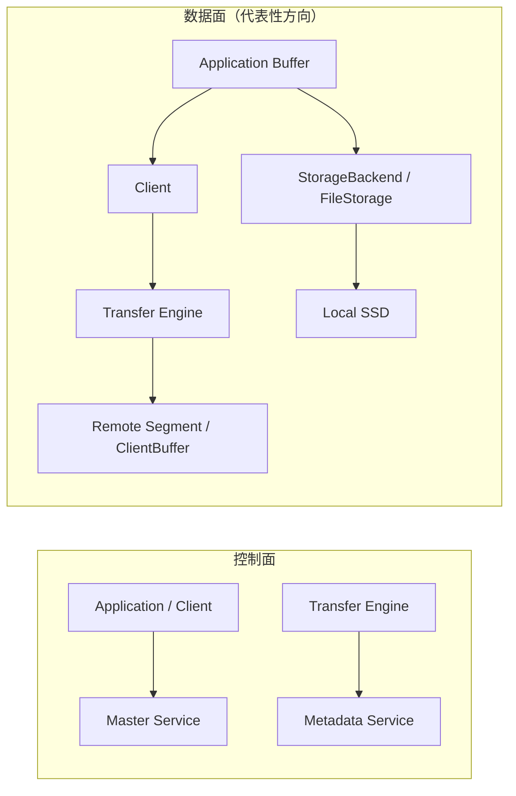

### 2.1 `Client / Service / Master / Transfer Engine` 关系图

这里先约定一下术语，避免混淆：

- `Client`
  - 更偏应用侧入口，比如 Python SDK、`DummyClient`、业务进程里的 store 调用方
- `Service`
  - 指 standalone 模式下的 `RealClient / store service`
  - 它既负责和 `Master` 交互，也负责驱动 `Transfer Engine`
- `Master`
  - 只负责控制面，不承载实际数据流
- `Transfer Engine`
  - 负责真正的数据传输

如果是 embedded 模式，`Client` 和 `Service` 会合并在同一个进程里；如果是 standalone 模式，它们之间会走本地 RPC / SHM。

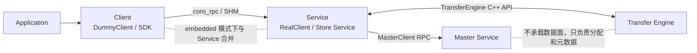

再看一张更偏“调用顺序”的图：

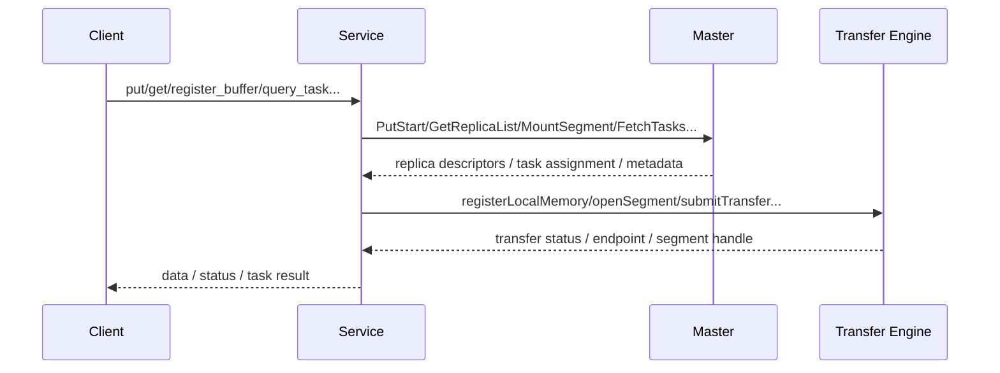

### 2.2 组件之间的调用接口

下面按“谁调用谁”来列主要接口。为了可读性，这里按功能分组，不展开所有内部 helper。

#### `Client -> Service`（standalone 模式）

这层接口主要由 `RealClient` 暴露，RPC 注册点在 `mooncake-store/src/real_client_main.cpp`。

| 功能 | 主要接口 |
| --- | --- |
| 健康检查 / 连通性 | `service_ready_internal`, `ping` |
| 写路径 | `put_dummy_helper`, `put_batch_dummy_helper`, `put_parts_dummy_helper`, `batch_put_from_dummy_helper`, `batch_put_from_multi_buffers_dummy_helper` |
| 更新路径 | `upsert_dummy_helper`, `upsert_from_dummy_helper`, `upsert_parts_dummy_helper`, `batch_upsert_from_dummy_helper`, `upsert_batch_dummy_helper` |
| 读路径 | `batch_get_into_dummy_helper`, `batch_get_into_multi_buffers_dummy_helper`, `get_into_range_shm_helper`, `get_into_ranges_shm_helper` |
| Buffer / SHM 管理 | `map_shm_internal`, `unmap_shm_internal`, `unregister_shm_buffer_internal`, `acquire_buffer_dummy`, `release_buffer_dummy`, `batch_acquire_buffer_dummy` |
| Hot cache / 特殊共享内存 | `acquire_hot_cache`, `release_hot_cache`, `batch_acquire_hot_cache`, `batch_release_hot_cache`, `ascend_shm_internal`, `ascend_ipc_shm_internal`, `ascend_unmap_shm_internal` |
| 删除 / 存在性 / 大小查询 | `remove_internal`, `removeByRegex_internal`, `removeAll_internal`, `batchRemove_internal`, `isExist_internal`, `batchIsExist_internal`, `getSize_internal` |
| 任务和 SSD 回读 | `create_copy_task`, `create_move_task`, `query_task`, `batch_get_offload_object`, `release_offload_buffer` |

#### `Service -> Master`

这层接口由 `MasterClient` 调用，服务端定义集中在 `mooncake-store/include/rpc_service.h` / `WrappedMasterService`。

| 功能 | 主要接口 |
| --- | --- |
| 对象查询 | `ExistKey`, `BatchExistKey`, `GetReplicaList`, `BatchGetReplicaList`, `GetReplicaListByRegex` |
| 写入生命周期 | `PutStart`, `PutEnd`, `PutRevoke`, `BatchPutStart`, `BatchPutEnd`, `BatchPutRevoke` |
| Upsert 生命周期 | `UpsertStart`, `UpsertEnd`, `UpsertRevoke`, `BatchUpsertStart`, `BatchUpsertEnd`, `BatchUpsertRevoke` |
| 删除 / 清理 | `Remove`, `BatchRemove`, `RemoveByRegex`, `BatchReplicaClear`, `BatchEvictDiskReplica`, `EvictDiskReplica` |
| Segment 管理 | `MountSegment`, `ReMountSegment`, `UnmountSegment`, `MountLocalDiskSegment` |
| 心跳 / 可用性 | `Ping`, `ServiceReady` |
| Offload 控制面 | `OffloadObjectHeartbeat`, `NotifyOffloadSuccess` |
| 任务调度 | `CreateCopyTask`, `CreateMoveTask`, `QueryTask`, `FetchTasks`, `MarkTaskToComplete` |
| Copy / Move 两阶段提交 | `CopyStart`, `CopyEnd`, `CopyRevoke`, `MoveStart`, `MoveEnd`, `MoveRevoke` |
| 管理 / 运维 | `BatchQueryIp`, `GetStorageConfig`, `GetFsdir`, `GetAllKeysForAdmin`, `GetAllSegmentsForAdmin`, `QuerySegmentForAdmin` |

#### `Service -> Transfer Engine`

这层接口是直接 C++ API 调用，定义集中在 `mooncake-transfer-engine/include/transfer_engine.h`。

| 功能 | 主要接口 |
| --- | --- |
| 初始化 / 发现 | `init`, `getLocalIpAndPort`, `getRpcPort`, `syncSegmentCache`, `getMetadata` |
| 本地内存注册 | `registerLocalMemory`, `unregisterLocalMemory`, `registerLocalMemoryBatch`, `unregisterLocalMemoryBatch` |
| Segment 打开 / 关闭 | `openSegment`, `closeSegment`, `removeLocalSegment`, `CheckSegmentStatus` |
| 传输提交 | `allocateBatchID`, `submitTransfer`, `submitTransferWithNotify`, `freeBatchID` |
| 传输状态 | `getTransferStatus`, `getBatchTransferStatus`, `getNotifies` |
| 通知 / 探活 | `sendNotifyByID`, `sendNotifyByName`, `probePeerAliveByID` |

#### 补充：`Transfer Engine -> Metadata Service`

虽然不在你这次点名的四个角色里，但这条边很关键，因为 `Transfer Engine` 要靠它发现远端 segment。

| 场景 | 接口 / 配置入口 |
| --- | --- |
| 初始化 metadata 连接 | `TransferEngine::init(metadata_conn_string, ...)` |
| 基于中心化 metadata 发现 segment | `http / etcd / redis` |
| 基于去中心化握手发现 segment | `P2PHANDSHAKE` |

### 2.3 一句话理解这四者的边界

- `Client` 负责把业务侧请求送进 Mooncake。
- `Service` 是真正的执行者，既连 `Master`，也驱动 `Transfer Engine`。
- `Master` 负责“分配、记账、调度”。
- `Transfer Engine` 负责“真正搬字节”。

## 3. 启动阶段先做什么

Mooncake 真正搬数据之前，先要把“可搬运的内存”和“可达的 endpoint”准备好。

### 3.1 Transfer Engine 初始化

大致调用链：

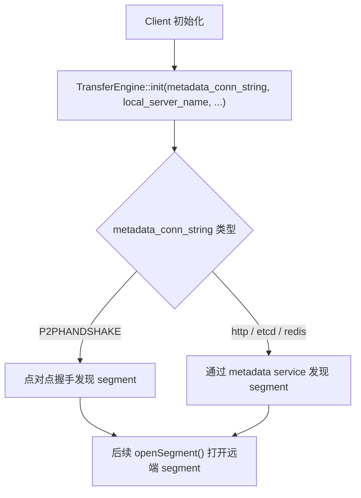

这里的关键点：

- `metadata_conn_string` 决定 `Transfer Engine` 如何发现远端 segment
- 如果是 `P2PHANDSHAKE`，Mooncake 走点对点握手，不依赖中心化 metadata 服务
- 如果是 `http/etcd/redis`，则通过这些服务做 segment 信息发现

### 3.2 挂载本地 segment

大致调用链：

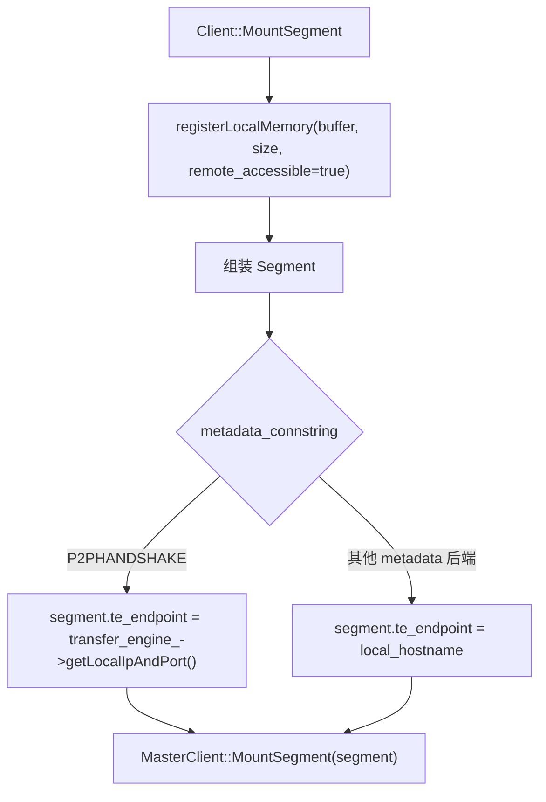

这一步做了两件事：

- 把一段本地内存注册给 `Transfer Engine`，让它可以被远端访问
- 把这段内存作为一个 `segment` 报给 `master`

还有一个很关键的细节：

- 如果 `metadata_connstring == P2PHANDSHAKE`
  - `segment.te_endpoint = transfer_engine_->getLocalIpAndPort()`
- 否则
  - `segment.te_endpoint = local_hostname`

也就是说，后面远端真正连过来时，走的是 `te_endpoint`。

## 4. 主路径 A: Put

`Put` 的本质是：“先让 `master` 分配目标副本位置，再把本地数据写到那些位置里”。

### 4.1 路径图

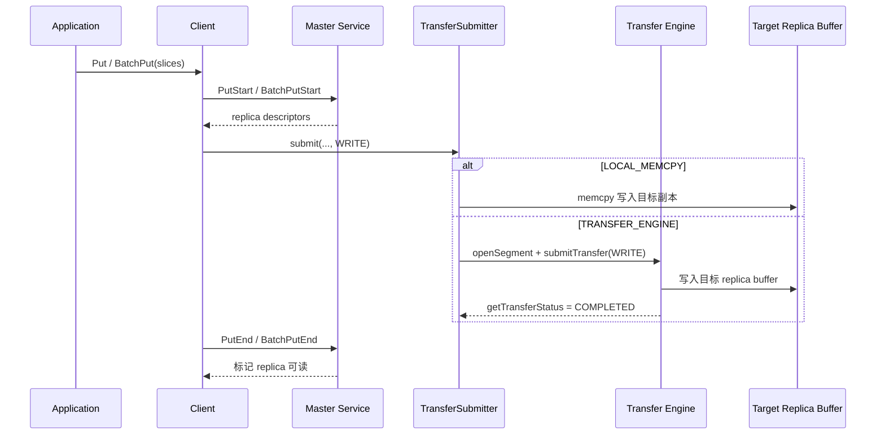

### 4.2 分步说明

1. 应用把待写入数据放在 `slices` 里，然后调用 `Put` 或 `BatchPut`。
2. `Client` 先向 `master` 发 `PutStart/BatchPutStart`。
3. `master` 只做分配，不搬数据。它返回的是副本位置描述符，也就是“应该把数据写到哪里”。
4. `Client::SubmitTransfers` 遍历这些副本，对每个内存副本调用 `TransferSubmitter::submit(..., WRITE)`。
5. `TransferSubmitter` 决定走哪条数据路径：
   - 同机且开启 `MC_STORE_MEMCPY=1` 时，优先走 `LOCAL_MEMCPY`
   - 否则走 `TRANSFER_ENGINE`
6. 如果走 `TRANSFER_ENGINE`，调用链大致是：

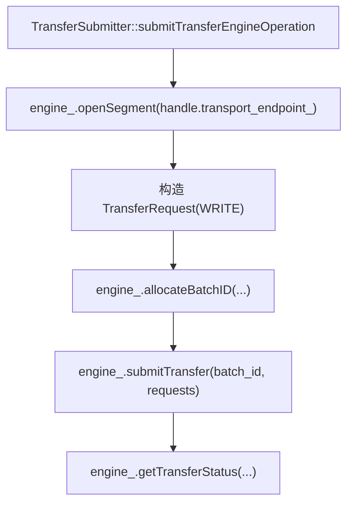

7. 所有副本写成功后，再调用 `PutEnd/BatchPutEnd` 通知 `master`：“这些 replica 现在可读了”。
8. 如果中途失败，则走 `PutRevoke/BatchPutRevoke` 撤销这次分配。

### 4.3 Put 里谁管什么

- `master`
  - 分配副本位置
  - 记录对象元数据
  - 在 `PutEnd` 后把副本状态切成可用
- `Transfer Engine`
  - 把本地 `slices` 里的字节写到远端副本地址
- `Client`
  - 串起整个过程，处理成功和失败收尾

### 4.4 Put 的一条简化记忆链

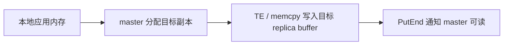

## 5. 主路径 B: Get

`Get` 的本质是：“先从 `master` 查哪个副本能读，再把数据拉回到应用给的目标内存”。

### 5.1 路径图

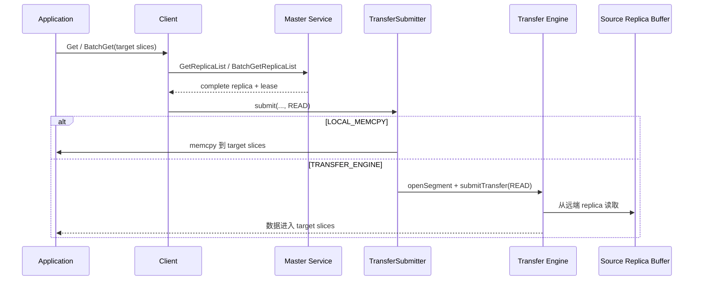

### 5.2 分步说明

1. 应用先提供目标 `slices`，也就是“数据要落到哪里”。
2. `Client::Query/BatchQuery` 向 `master` 查副本列表和 lease TTL。
3. `Client::BatchGet` 选择第一个可用的 `complete replica`。
4. 如果启用了 hot cache，还可能先把读请求重定向到本地 hot cache。
5. 然后调用 `TransferSubmitter::submit(..., READ)`。
6. 数据路径有两种：
   - `LOCAL_MEMCPY`
     - 适用于同机本地副本
     - 本质上是把副本 buffer 里的字节直接 `memcpy` 到目标 `slices`
   - `TRANSFER_ENGINE`
     - 先 `openSegment(endpoint)`
     - 再提交 `READ` 请求
     - 由 TE 把远端 segment 里的数据拉到本地目标 buffer
7. 传输结束后，`Client` 还会检查 lease 有没有在传输期间过期。

### 5.3 Get 的一条简化记忆链

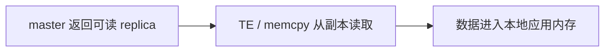

## 6. 主路径 C: 内存副本 offload 到 SSD

这条路径是“本地内存 -> 本地 SSD”，不走远端网络。

### 6.1 路径图

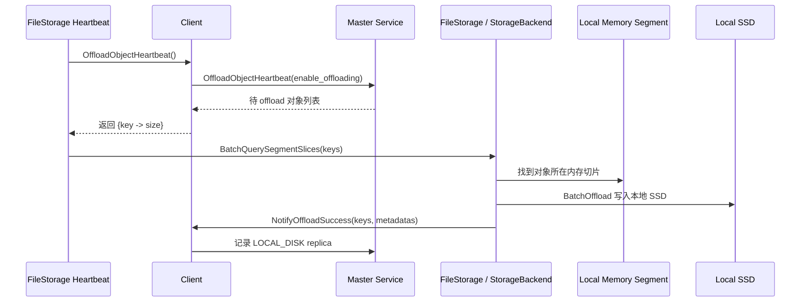

### 6.2 分步说明

1. `FileStorage` 内部有 heartbeat 线程。
2. 它周期性调用 `Client::OffloadObjectHeartbeat`。
3. `master` 返回一批建议 offload 的对象 `{key -> size}`。
4. `FileStorage::BatchQuerySegmentSlices` 再去查询这些对象当前在本地内存里的切片位置。
5. `StorageBackend::BatchOffload` 把这些字节写到本地 SSD。
6. 成功后调用 `Client::NotifyOffloadSuccess(keys, metadatas)`。
7. `master` 给这些对象补上一类新的副本：`LOCAL_DISK`。

### 6.3 这一段最容易混淆的点

offload 发生时：

- 数据不经过 `master`
- `master` 只是决定“哪些对象应该下沉”
- 真正写盘的是本地 `FileStorage + StorageBackend`

## 7. 主路径 D: 从 SSD 回读到请求方

这条路径比普通 `Get` 多了一跳，因为数据先在对端 SSD，不在对端内存 segment。

### 7.1 路径图

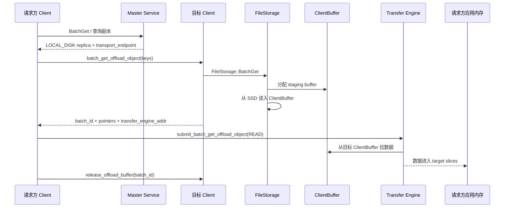

### 7.2 分步说明

1. 请求方先正常做 `BatchGet` 的元数据查询。
2. `master` 返回的副本如果是 `LOCAL_DISK`，其中会带上目标 client 的 `transport_endpoint`。
3. 请求方通过 RPC 找到这个目标 client，请它执行 `batch_get_offload_object`。
4. 目标 client 的 `FileStorage::BatchGet`：
   - 先在 `ClientBuffer` 里分配一块 staging buffer
   - 再从 SSD 把对象读到这块 buffer
   - 返回 `batch_id + pointers + transfer_engine_addr + gc_ttl_ms`
5. 请求方拿到这些 `pointers` 后，调用 `Client::BatchGetOffloadObject`。
6. 这一步内部会走 `TransferSubmitter::submit_batch_get_offload_object`：
   - `openSegment(transfer_engine_addr)`
   - 为每个对象构造 `READ` 请求
   - 由 `Transfer Engine` 把数据从对端 `ClientBuffer` 拉到请求方 `slices`
7. 传输完成后，请求方再调用 `release_offload_buffer(batch_id)` 释放对方 staging buffer。

### 7.3 这条路径的核心认知

SSD 回读不是：

`SSD -> master -> 请求方`

而是：

`目标 SSD -> 目标 ClientBuffer -> Transfer Engine -> 请求方内存`

## 8. 主路径 E: Replica Copy / Move

如果你理解成“副本搬家”，这条路径是最贴近“搬移”的。

### 8.1 CreateCopyTask / CreateMoveTask 的路径

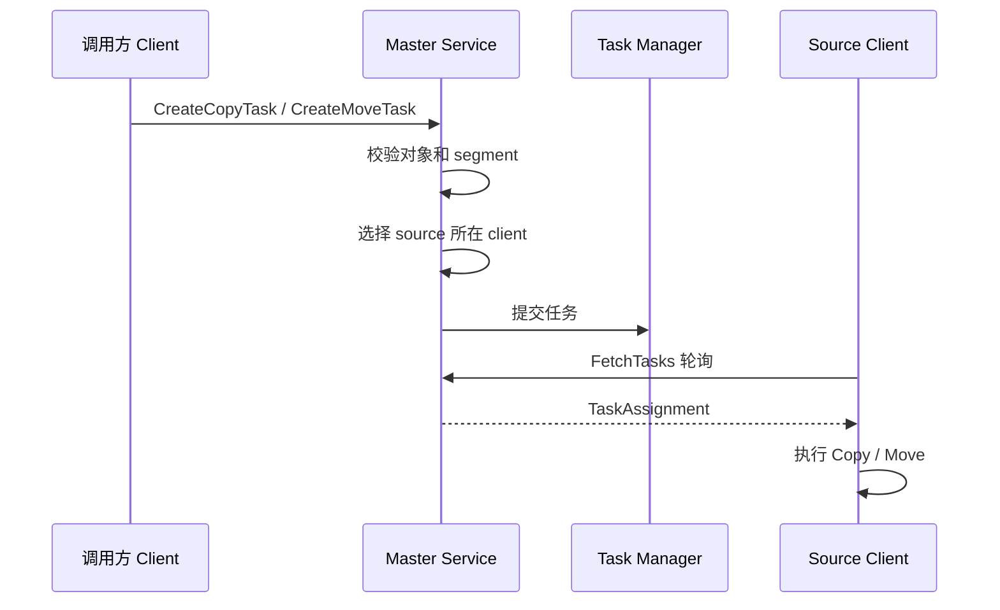

### 8.2 实际搬数据时怎么走

`Copy` 和 `Move` 的执行路径很像：

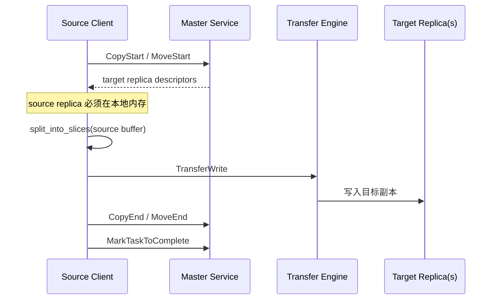

其中真正的数据移动仍然是：

`源副本内存 -> Transfer Engine -> 目标副本内存`

而不是经由 `master` 中转。

### 8.3 Move 和 Copy 的区别

- `Copy`
  - 在保留源副本的前提下新增目标副本
- `Move`
  - 更像“迁移”
  - 成功后由 `MoveEnd` 完成元数据切换和源副本处理

## 9. Embedded 模式和 Standalone 模式的差异

Mooncake Store 文档里提到 `Client` 有两种使用方式。

### 9.1 Embedded 模式

特点：

- 路径最短
- 适合直接嵌到推理进程里

### 9.2 Standalone 模式

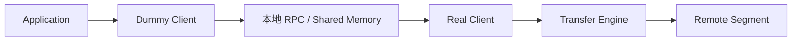

特点：

- 应用侧是轻量 wrapper
- 真实的数据搬运、RPC、内存管理都在 `Real Client`

所以如果你在看集成系统里的“数据路径”，要先确认自己是 embedded 还是 standalone。

## 10. 控制面和数据面的边界

这是最值得记住的一点。

### 10.1 什么走 `master`

- `PutStart / PutEnd / PutRevoke`
- `GetReplicaList / BatchGetReplicaList`
- `MountSegment / UnmountSegment`
- `Copy/Move` 任务创建和状态更新
- `OffloadObjectHeartbeat / NotifyOffloadSuccess`

### 10.2 什么不走 `master`

- `Put` 的实际字节写入
- `Get` 的实际字节读取
- `Replica Copy/Move` 的实际副本复制
- SSD offload 的实际写盘
- SSD 回读后的实际跨节点搬运

换句话说：

> `master` 决定“搬什么、搬到哪、现在能不能搬”；`Transfer Engine / memcpy / StorageBackend` 决定“字节怎么搬”。

## 11. 关键代码定位

如果你后面想继续顺着代码往下看，可以从这些入口开始：

- `mooncake-store/src/client_service.cpp`
  - `Client::MountSegment`
  - `Client::Put`
  - `Client::BatchPut`
  - `Client::BatchGet`
  - `Client::BatchGetOffloadObject`
  - `Client::Copy`
  - `Client::Move`
- `mooncake-store/src/transfer_task.cpp`
  - `TransferSubmitter::submit`
  - `TransferSubmitter::submitTransferEngineOperation`
  - `TransferSubmitter::submitMemcpyOperation`
  - `TransferSubmitter::submit_batch_get_offload_object`
  - `TransferSubmitter::selectStrategy`
- `mooncake-store/src/file_storage.cpp`
  - `FileStorage::Heartbeat`
  - `FileStorage::OffloadObjects`
  - `FileStorage::BatchGet`
- `mooncake-store/src/master_service.cpp`
  - `MasterService::CreateCopyTask`
  - `MasterService::CreateMoveTask`
- `mooncake-transfer-engine/src/transfer_engine.cpp`
  - `TransferEngine::init`
  - `TransferEngine::openSegment`
  - `TransferEngine::registerLocalMemory`
  - `TransferEngine::submitTransfer`
  - `TransferEngine::getTransferStatus`

## 12. 一句话记忆版

如果只记一句话，可以记这个：

> Mooncake 的 `master` 主要负责“分配和记账”，真正的数据搬移通常发生在 `Client / Transfer Engine / StorageBackend` 之间，数据面默认不经过 `master`。
